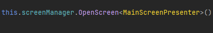

-Cách setup Pipeline để build game xem tại đây:
https://lifegroup.sg.larksuite.com/docx/KrHSdFnihog0z2xdPgvlrugkgfe?from=from_copylink

Các bước để setup Project:

- Để tạo 1 project mới vào
- Chọn User This Template
  
- Đặt tên project
- 
- Create repository from template
- Clone về máy
- Chạy file SetupProject.bat
- 
- Đợi file bat commit và push lại lên git với repository mới tạo
- Mở Project với unity
- 

-Switch sang android platform vả chạy loading scene

- Các framework và services cần nắm trong project bao gồm
- Dependency Injection: Zenject - Dùng để inject các object vào các class khác
- UniTask - Async/Await thay thế cho Task
- Addressable - Dùng để load asset từ addressable
- R3 - ReactiveX cho unity
- MVP Design Pattern
- ScreenManager - Quản lý các màn hình/Popup trong game
- SceneDirector - Quản lý các scene trong game
- SignalBus - Dùng để gửi thông tin Data giữa các class
- LocalData/LocalDataController - Quản lý dữ liệu lưu trữ local trong game
- Blueprint Data - là nơi lữu trữ raw data của game, GameDesigner sẽ thay đổi data và Dev có thể dùng trực tiếp trong game qua dạng mapping Dictionary mà ko cần bước trung gian chuyển đổi sang
  ScriptableObject or JSON.
- SoundManager - Quản lý âm thanh trong game
- FeatureAdsServices - Quản lý quảng cáo trong game
- FeatureIAPServices - Quản lý In App Purchase trong game
- FeatureAnalyticsServices - Quản lý phần gửi thông tin analytics trong game lên Firebase,Adjust,Appsflyer...
- ... các services khác mọi người sẽ tìm hiểu dần trong quá trình làm việc.

- Sau đây là chi tiết từng phần

- Dependency Injection: Zenject
- Follow here https://github.com/modesttree/Zenject
- UniTask - Async/Await thay thế cho Task
- Follow here https://github.com/Cysharp/UniTask

- Addressable dùng để load asset từ addressable thay vì load từ Resources hoặc kéo reference vào một cách trực tiếp từ inspector
- Để mở màn hình addressable vào Window -> Asset Management -> Addressable -> Groups
- 

Để tạo 1 group mới vào màn hình Addressable Groups -> Create -> New Group

- 
- Sau đó đổi lại tên group
- ví dụ để gắn 1 GameObject vào addressable kéo thả GameObject vào group tưởng ứng rồi chọn Simply Addressable Names
- 
- Để load asset từ addressable vào code sử dụng ta cần Inject IGameAsset vào class cần load asset
- 
- Tương tự với các kiểu object khác như Texture2D, Sprite, AudioClip, TextAsset, Material....

- R3 - ReactiveX cho unity
- Follow here https://github.com/Cysharp/R3

- MVP Design Pattern
- Là một design pattern giúp chia nhỏ các phần trong game thành các module nhỏ dễ quản lý và mở rộng, giúp code dễ đọc và dễ maintain hơn
- Model: Là nơi chứa dữ liệu và logic xử lý dữ liệu
- View: Là nơi chứa các component hiển thị dữ liệu
- Presenter: Là nơi chứa logic xử lý dữ liệu và giao tiếp giữa Model và View
- 
- ScreenManager - Quản lý các màn hình/Popup trong game
- Trong game có 2 phần gồm Screen và Popup
- Screen: Là màn hình chính của game
- Popup: Là màn hình phụ xuất hiện trên màn hình chính
- Để Open 1 Screen/Popup cần làm những bước sau
- Bước 1 tạo Addressable cho Screen/Popup, các prefab Screen/Popup đã có sẵn base trong project, hãy tạo variant từ prefab Screen/Popup đó
  
- Bước 2 để mở 1 Screen/Popup cần Inject ScreenManager và gọi OpenScreen/Popup
  
- Chú ý ở Presenter phải có Attribute [ScreenInfo] hoặc [PopupInfo] để ScreenManager có thể tìm được Screen/Popup tương ứng
- 
- Chú ý 1: ở mỗi Sreen/Popup đều kế thừa từ BaseScreenPresenterTemplate hoặc BasePopupPresenterTemplate đã được Inject ScreenManager vào và chỉ gần Gọi OpenScreen/Popup
- Chú ý 2: Khi mở Screen1 => popup 1 => screen 2 thì phải close screen 1 đi thông qua ScreenManager

- SignalBus - Dùng để gửi thông tin Data giữa các class
- Giống như Action/Event nhưng mạnh mẽ hơn, có thể gửi thông tin giữa các class mà không cần phải biết class đó là gì
- Signal trước khi được dùng cần được Declare trong ProjectInstaller hoặc SceneInstller Tham khảo class FeatureSignalInstaller
- Cú pháp để sử dụng Signal
- 
- Chú ý nhớ phải Unsubcribe Signal khi không cần sử dụng nữa

- SceneDirector - Quản lý các scene trong game
- Để chuyển từ Scene sang Scene khác ta cần gắn Addressalbe vào Scene cần chuyển
- 
- Để chuyển Scene ta cần Inject SceneDirector và gọi LoadSingleSceneAsync với Parameter là SceneName được gắn vào Addressable
- 
- Chú ý ở mỗi Screen/Popup đều kế thừa từ BaseScreenPresenterTemplate hoặc BasePopupPresenterTemplate đã được Inject SceneDirector vào và chỉ cần gọi OpenScene(string sceneName) để chuyển Scene.
  -Lưu ý: SceneDirector chỉ chuyển Scene không chuyển Screen/Popup

- LocalData/LocalDataController - Quản lý dữ liệu lưu trữ local trong game
- Dữ liệu trong game sẽ được lưu vào Preferences của Unity, các Data sẽ được convert sang JSON và lưu vào Preferences một cách tự động khi ApplicationPause hoặc ApplicationQuit
- Để thay đổi data ta chỉ được phép thay đổi trong Controller tương ứng
- Để tạo một data mới cần Kế thừa 2 Interface sau ILocalData,IFeatureLocalData
- 
- Sau đó tạo 1 class Controller Để quan lý Data tương ứng, điều này mục đích tất cả các services khác sẽ ko thể thay đổi data 1 cách trực tiếp mà phải thông qua Controller
- Controller Sẽ kế thừa IFeatureControllerData
- 
- Tất cả các Controller/Data sẽ được tạo tự động khi chạy game với Reflection, nếu lần đầu vào game chưa có data sẽ tạo mới data, nếu đã có data sẽ load data từ Preferences
- [Inject] ControllerData tương ứng vào class muốn thay đổi data
- 
- Một số LocalData dã có sẵn, mọi người nên đọc để biết xem data đó lưu trữ gì
- 

- Blueprint Data - BlueprintReader service này dùng để load tất cả blueprint đã được gọi sẵn ở LoadingScene.
- Để tạo blueprint ta cần 2 phần
- File csv được lưu ở Resources/BlueprintData/BlueprintName.csv

Ví dụ file csv như sau

- Chú ý tất cả các file csv phải có header đầu tiên, và trong class phải có tất cả các header đó tương ứng với các property
- 
- Tạo 1 class tương ứng với blueprint, cần chú ý BlueprintReader attribute là tên file csv được lưu trong BlueprintData, CSVHeaderKey là Key ứng với dictionary khi load data
- 
- Trong blueprint Dictionary Có thể có thêm Dictionary gọi là subBlueprint để lưu trữ dữ liệu con cú pháp như sau
- 
- Để truy cập data ta Inject class blueprint vào class cần sử dụng
- Chú ý đây là raw data và ko được thay đổi data trong đó, nếu muốn hãy clone data ra và thay đổi data clone

- SoundManager - Quản lý âm thanh trong game
- Tương tự các services khác việc quản lý âm thanh dễ dàng chỉ cần Inject IAudioService và PlaySound với addressable audio clip được gắn trên addresable

- FeatureAdsServices - Quản lý quảng cáo trong game
- Đây là server dùng để show quảng cáo trong game, hiện tại đã hỗ trợ Admob, IronSource, AppLovin, khi nào đến phần tích hợp ads sẽ nói rõ hơn, cái này phải thực chiến.

- FeatureIAPServices - Quản lý In App Purchase trong game
- Đây là server dùng để quản lý In App Purchase trong game, hiện tại đã hỗ trợ GooglePlay, AppStore, khi nào đến phần tích hợp IAP sẽ nói rõ hơn, cái này phải thực chiến.

- FeatureAnalyticsServices - Quản lý phần gửi thông tin analytics trong game lên Firebase,Adjust,Appsflyer...
- MindSet là khi bất cứ 1 action gì sẽ bắn Signal => FeatureAnalyticsServices sẽ lắng nghe Signal và gửi thông tin lên tất cả các services analytics đã được tích hợp
- Hiện tại đã hỗ trợ Firebase, Adjust, Appsflyer, khi nào đến phần tích hợp sẽ nói rõ hơn, cái này phải thực chiến.
- Các services khác mọi người sẽ tìm hiểu dần trong quá trình làm việc.
- Chúc mọi người làm việc hiệu quả và thành công.